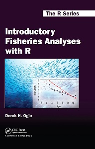

I am pleased to announce that my *Introductory Fisheries Analyses with R* (IFAR) book has been published, almost two weeks ahead of schedule.  Details about the book (and companion website) [are here](http://derekogle.com/IFAR/) and it can be purchased [from CRC Press](https://www.crcpress.com/Introductory-Fisheries-Analyses-with-R/Ogle/9781482235203) (at a 20% discount through the end of the year).  A brief description and table of contents for the book are below.

----

### Brief Description

*Introductory Fisheries Analyses with R* provides detailed instructions on how to perform basic fisheries stock assessment analyses in the R environment. The analyses covered are typical analyses for many working fisheries scientists and, thus, also occur in most upper-level undergraduate and graduate level fisheries science, analysis, or management courses. The book begins with three foundational chapters (R basics, data manipulation, and plotting) that help the reader become familiar with R within the context of basic fisheries analyses and examples.  The remaining chapters build upon these foundational skills with analytical techniques specific to fisheries stock assessments.

### Table of Contents

1. **(Very Brief) Introduction to R Basics**
    * The bare fundamentals of R that are required for the remainder of the book.
1. **Loading Data and Basic Manipulations**
    * Load data into R from external files and perform typical manipulations including filtering, sorting, aggregating, joining, and converting between wide- and long-formats.
1. **Plotting Fundamentals**
    * The bare fundamentals for constructing basic plots using base R.
1. **Age Comparisons**
    * Compare two or more estimates of age for the same fish with precision and bias metrics and plots.
1. **Age-Length Keys**
    * Assign ages to unaged fish from their length and an age-length-key.
1. **Size Structure**
    * Assess size structure through length frequencies and the proportional size distribution (PSD) metric.
1. **Weight-Length Relationships**
    * Introduction to simple linear regression through examination of weight-length relationships.
1. **Condition**
    * Compute condition metrics from observed length and weights.  Introduction to one-way ANOVA.
1. **Abundance from Capture-Recapture Data**
    * Estimate abundance from capture-recapture data for closed (single and multiple recapture events) and open populations.
1. **Abundance from Depletion Data**
    * Estimate abundance from removal or depletion samplings (Leslie, DeLury, k-pass).
1. **Mortality Rates**
    * Estimate total mortality rates from catch curve and capture-recapture data.  Estimate fishing and natural mortality with empirical models.
1. **Individual Growth**
    * Estimate parameters for the von Bertalanffy growth function and compare growth parameters among populations.
1. **Recruitment**
    * Estimate parameters for the Beverton-Holt and Ricker stock-recruitment models, compute spawning potential ratios, and estimate year-class strengths from catch data.
