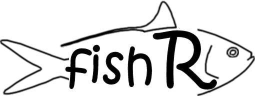

The **fishR** website provides examples and resources for fisheries-related analyses performed in [R](https://www.r-project.org/).  It is my hope that these resources will help you to either use R or expand your knowledge of [R](https://www.r-project.org/) for fisheries-related analyses.  Take a look around!!

[R is an environment](https://www.r-project.org/) for statistical analyses and graphics that is rapidly gaining popularity with fisheries scientists.  See [Inside-R](http://www.inside-r.org/what-is-r) and [R-project](https://www.r-project.org/about.html) for two descriptions of R.

  

